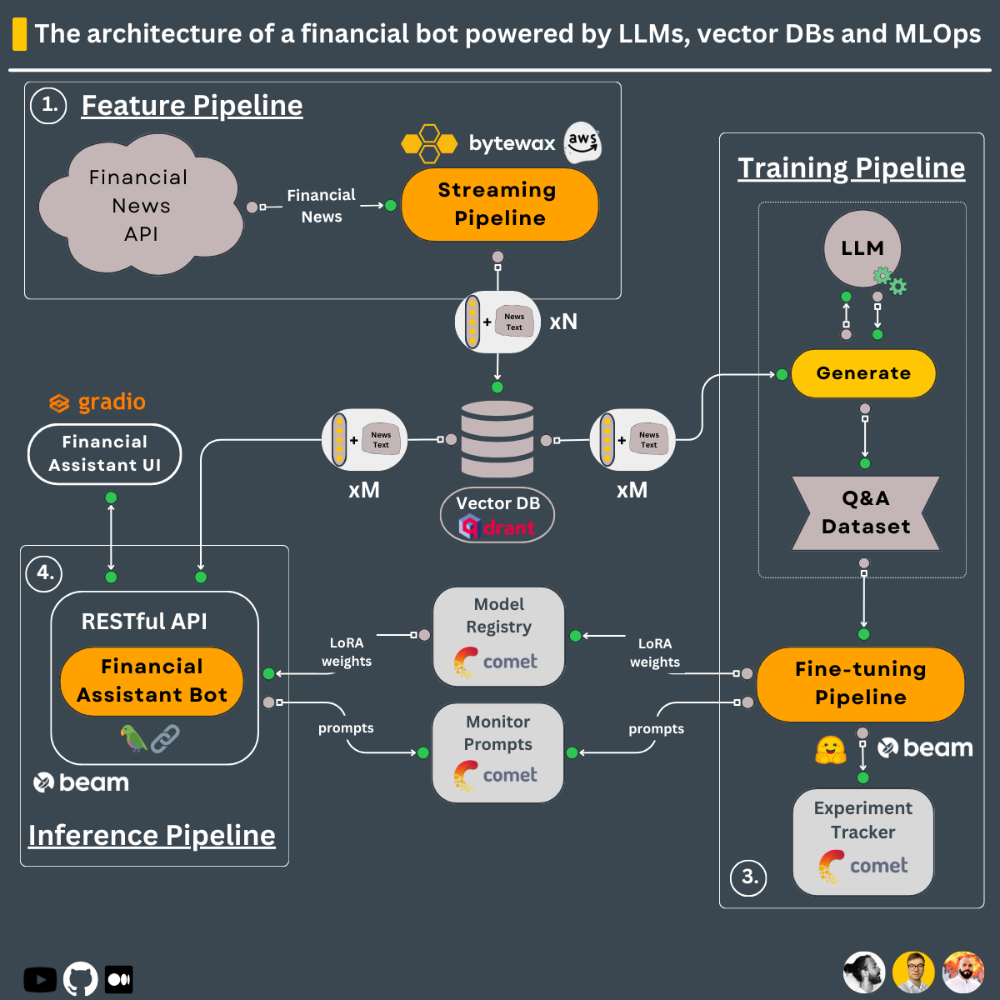
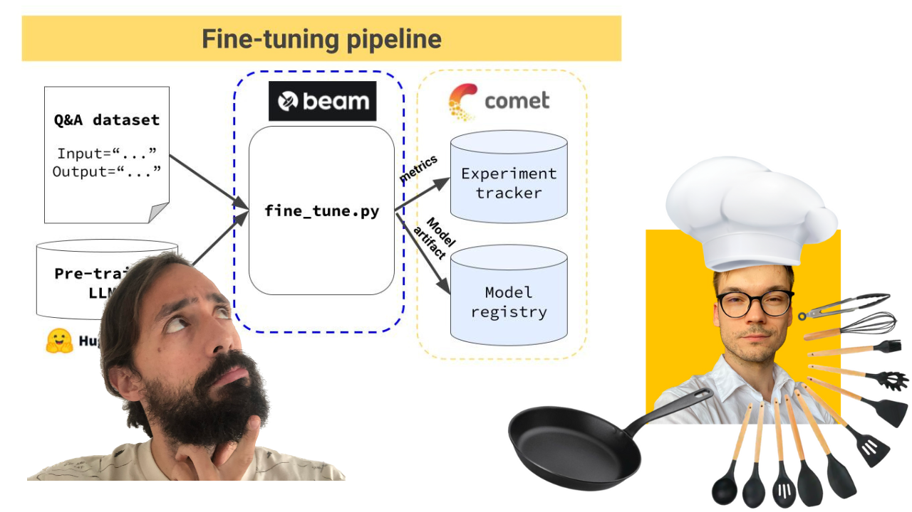
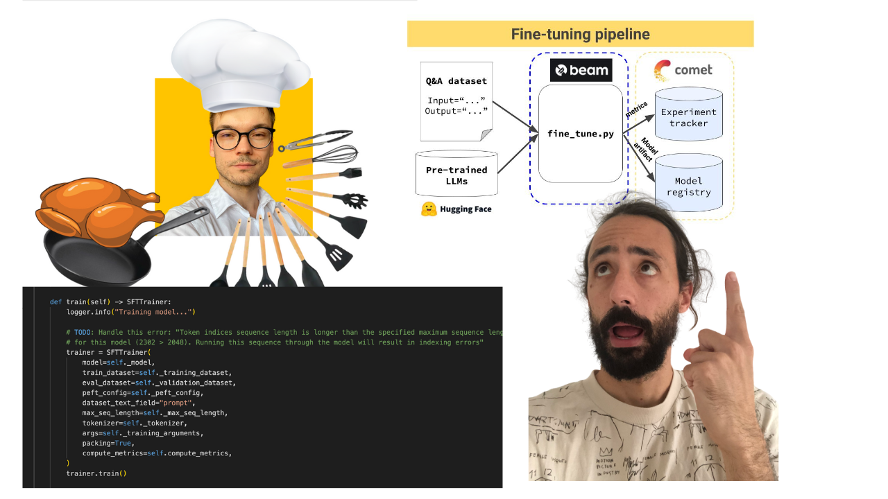

<div align="center">
    <h2>Hands-on LLMs Course </h2>
    <h1>Train and Deploy a Real-Time Financial Advisor</h1>
    <i>by <a href="https://github.com/iusztinpaul">Paul Iusztin</a>, <a href="https://github.com/Paulescu">Pau Labarta Bajo</a> and <a href="https://github.com/Joywalker">Alexandru Razvant</a></i>
</div>

## Table of Contents

- [1. Building Blocks](#1-building-blocks)
- [2. Setup External Services](#2-setup-external-services)
- [3. Install & Usage](#3-install--usage)
- [4. Video lectures](#4-video-lectures)
- [5. License](#5-license)
- [6. Contributors & Teachers](#6-contributors--teachers)

------


## 1. Building Blocks

### 1.1. Training pipeline 🖋️ 

Training pipeline that:
- loads a proprietary Q&A dataset 
- fine-tunes an open-source LLM using QLoRA
- logs the training experiments on [Comet ML's](https://www.comet.com?utm_source=thepauls&utm_medium=partner&utm_content=github) experiment tracker & the inference results on [Comet ML's](https://www.comet.com?utm_source=thepauls&utm_medium=partner&utm_content=github) LLMOps dashboard
- stores the best model on [Comet ML's](https://www.comet.com/site/products/llmops/?utm_source=thepauls&utm_medium=partner&utm_content=github) model registry

The **training pipeline** is **deployed** using [Beam](https://docs.beam.cloud/getting-started/quickstart?utm_source=thepauls&utm_medium=partner&utm_content=github) as a serverless GPU infrastructure.

-> Found under the `modules/training_pipeline` directory.

### 1.2. Streaming real-time pipeline 🚰

Real-time feature pipeline that:
- ingests financial news from [Alpaca](https://alpaca.markets/docs/api-references/market-data-api/news-data/)
- cleans & transforms the news documents into embeddings in real-time using [Bytewax](https://github.com/bytewax/bytewax?utm_source=thepauls&utm_medium=partner&utm_content=github)
- stores the embeddings into the [Qdrant Vector DB](https://qdrant.tech/?utm_source=thepauls&utm_medium=partner&utm_content=github)

The **streaming pipeline** is **automatically deployed** on an AWS EC2 machine using a CI/CD pipeline built in GitHub actions.

-> Found under the `modules/streaming_pipeline` directory.

### 1.3. Inference pipeline 🤖

Inference pipeline that uses [LangChain](https://github.com/langchain-ai/langchain) to create a chain that:
* downloads the fine-tuned model from [Comet's](https://www.comet.com?utm_source=thepauls&utm_medium=partner&utm_content=github) model registry
* takes user questions as input
* queries the [Qdrant Vector DB](https://qdrant.tech/?utm_source=thepauls&utm_medium=partner&utm_content=github) and enhances the prompt with related financial news
* calls the fine-tuned LLM for financial advice using the initial query, the context from the vector DB, and the chat history
* persists the chat history into memory 
* logs the prompt & answer into [Comet ML's](https://www.comet.com/site/products/llmops/?utm_source=thepauls&utm_medium=partner&utm_content=github) LLMOps monitoring feature

The **inference pipeline** is **deployed** using [Beam](https://docs.beam.cloud/deployment/rest-api?utm_source=thepauls&utm_medium=partner&utm_content=github) as a serverless GPU infrastructure, as a RESTful API. Also, it is wrapped under a UI for demo purposes, implemented in [Gradio](https://www.gradio.app/).

-> Found under the `modules/financial_bot` directory.

<br/>




## 2. Setup External Services

Before diving into the modules, you have to set up a couple of additional external tools for the course.

### 2.1. Alpaca
`financial news data source`

Follow this [document](https://alpaca.markets/docs/market-data/getting-started/) to show you how to create a FREE account and generate the API Keys you will need within this course.

**Note:** 1x Alpaca data connection is FREE.

### 2.2. Qdrant
`serverless vector DB`

Go to [Qdrant](https://qdrant.tech/?utm_source=thepauls&utm_medium=partner&utm_content=github) and create a FREE account.

After, follow [this document](https://qdrant.tech/documentation/cloud/authentication/?utm_source=thepauls&utm_medium=partner&utm_content=github) on how to generate the API Keys you will need within this course.

**Note:** We will use only Qdrant's freemium plan. 

### 2.3. Comet ML
`serverless ML platform`

Go to [Comet ML](https://www.comet.com/signup?utm_source=thepauls&utm_medium=partner&utm_content=github) and create a FREE account.

After, [follow this guide](https://www.comet.com/docs/v2/guides/getting-started/quickstart/) to generate an API KEY and a new project, which you will need within the course.

**Note:** We will use only Comet ML's freemium plan. 

### 2.4. Beam
`serverless GPU compute | training & inference pipelines`

Go to [Beam](https://www.beam.cloud?utm_source=thepauls&utm_medium=partner&utm_content=github) and create a FREE account.

After, you must follow their [installation guide](https://docs.beam.cloud/getting-started/installation?utm_source=thepauls&utm_medium=partner&utm_content=github) to install their CLI & configure it with your Beam credentials.

To read more about Beam, here is an [introduction guide](https://docs.beam.cloud/getting-started/introduction?utm_source=thepauls&utm_medium=partner&utm_content=github).

**Note:** You have ~10 free compute hours. Afterward, you pay only for what you use. If you have an Nvidia GPU >8 GB VRAM & don't want to deploy the training & inference pipelines, using Beam is optional. 

#### Troubleshooting

When using Poetry, we had issues locating the Beam CLI inside a Poetry virtual environment. To fix this, after installing Beam, we create a symlink that points to Poetry's binaries, as follows:
 ```shell
  export COURSE_MODULE_PATH=<your-course-module-path> # e.g., modules/training_pipeline
  cd $COURSE_MODULE_PATH
  export POETRY_ENV_PATH=$(dirname $(dirname $(poetry run which python)))

  ln -s /usr/local/bin/beam ${POETRY_ENV_PATH}/bin/beam
 ```


 ### 2.5. AWS
 `cloud compute | feature pipeline`

 Go to [AWS](https://aws.amazon.com/console/), create an account, and generate a pair of credentials.

 After, download and install their [AWS CLI](https://docs.aws.amazon.com/cli/latest/userguide/getting-started-install.html) and [configure it](https://docs.aws.amazon.com/cli/latest/userguide/cli-chap-configure.html) with your credentials.

 **Note:** You will pay only for what you use. You will deploy only a `t2.small` EC2 VM, which is only `~$0.023` / hour. If you don't want to deploy the feature pipeline, using AWS is optional.


## 3. Install & Usage
Every module has its dependencies and scripts. In a production setup, every module would have its repository, but in this use case, for learning purposes, we put everything in one place:

Thus, check out the README for every module individually to see how to install & use it:
1. [q_and_a_dataset_generator](/modules/q_and_a_dataset_generator/)
2. [training_pipeline](/modules/training_pipeline/)
3. [streaming_pipeline](/modules/streaming_pipeline/)
4. [inference_pipeline](/modules/financial_bot/)

## 4. Video lectures

### 4.0 Intro to the course

<div align="center">
  <a href="https://www.youtube.com/watch?v=l4HTEf0_s70">
      <p>Click here to watch the video 🎬</p>
    
  </a>
</div>


### 4.1 Fine-tuning our open-source LLM (overview)

<div align="center">
  <a href="https://www.youtube.com/watch?v=HcxwOYMmj40">
      <p>Click here to watch the video 🎬</p>
    
  </a>
</div>

### 4.2 Fine-tuning our open-source LLM (Hands-on!)

<div align="center">
  <a href="https://www.youtube.com/watch?v=RS96R0dH0uE">
      <p>Click here to watch the video 🎬</p>
    
  </a>
</div>

## 5. License

This course is an open-source project released under the MIT license. Thus, as long you distribute our LICENSE and acknowledge our work, you can safely clone or fork this project and use it as a source of inspiration for whatever you want (e.g., university projects, college degree projects, etc.).

## 6. Contributors & Teachers

<table>
  <tr>
    <td></td>
    <td>
      <strong>Pau Labarta Bajo | Senior ML & MLOps Engineer </strong><br />
      <i>Main teacher. The guy from the video lessons.</i><br /><br />
      <a href="https://www.linkedin.com/in/pau-labarta-bajo-4432074b/">LinkedIn</a><br />
      <a href="https://twitter.com/paulabartabajo_">Twitter/X</a><br />
      <a href="https://www.youtube.com/@realworldml">Youtube</a><br />
      <a href="https://www.realworldml.xyz/subscribe">Real-World ML Newsletter</a><br />
      <a href="https://www.realworldml.xyz/subscribe">Real-World ML Site</a>
    </td>
  </tr>
  <tr>
    <td></td>
    <td>
      <strong>Alexandru Razvant | Senior ML Engineer </strong><br />
      <i>Second chef. The engineer behind the scenes.</i><br /><br />
      <a href="https://www.linkedin.com/in/arazvant/">LinkedIn</a><br />
      <a href="https://www.neuraleaps.com/">Neura Leaps</a>
    </td>
  </tr>
  <tr>
    <td></td>
    <td>
      <strong>Paul Iusztin | Senior ML & MLOps Engineer </strong><br />
      <i>Main chef. The guys who randomly pop in the video lessons.</i><br /><br />
      <a href="https://www.linkedin.com/in/pauliusztin/">LinkedIn</a><br />
      <a href="https://twitter.com/iusztinpaul">Twitter/X</a><br />
      <a href="https://pauliusztin.substack.com/">Decoding ML Newsletter</a><br />
      <a href="https://www.pauliusztin.me/">Personal Site | ML & MLOps Hub</a>
    </td>
  </tr>
</table>
