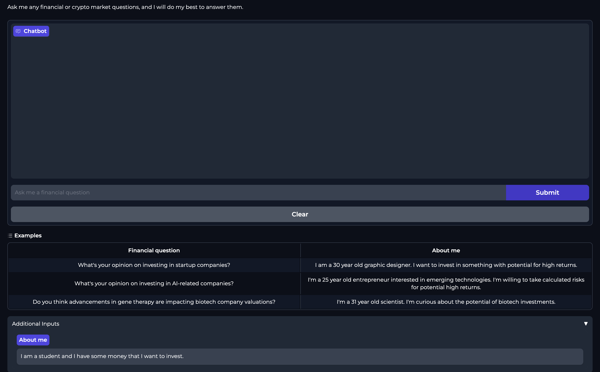

# Financial Assistant Bot

Inference pipeline that uses [LangChain](https://github.com/langchain-ai/langchain) to create a chain that:
* downloads the fine-tuned model from [Comet's](https://www.comet.com?utm_source=thepauls&utm_medium=partner&utm_content=github) model registry
* takes user questions as input
* queries the [Qdrant Vector DB](https://qdrant.tech/?utm_source=thepauls&utm_medium=partner&utm_content=github) and enhances the prompt with related financial news
* calls the fine-tuned LLM for financial advice using the initial query, the context from the vector DB, and the chat history
* persists the chat history into memory 
* logs the prompt & answer into [Comet ML's](https://www.comet.com/site/products/llmops/?utm_source=thepauls&utm_medium=partner&utm_content=github) LLMOps monitoring feature

The **inference pipeline** is **deployed** using [Beam](https://docs.beam.cloud/deployment/rest-api?utm_source=thepauls&utm_medium=partner&utm_content=github) as a serverless GPU infrastructure, as a RESTful API. Also, it is wrapped under a UI for demo purposes, implemented in [Gradio](https://www.gradio.app/).

## Table of Contents

- [1. Motivation](#1-motivation)
- [2. Install](#2-install)
    - [2.1. Dependencies](#21-dependencies)
    - [2.2. Qdrant & Beam](#21-qdrant--beam)
- [3. Usage](#3-usage)
    - [3.1. Local](#31-local)
    - [3.2. Deploy to Beam as a RESTful API](#32-deploy-to-beam)
    - [3.3. Gradio UI](#33-gradio-ui)
    - [3.4. Linting & Formatting](#34-linting--formatting)

# 1. Motivation

The inference pipeline defines how the user interacts with all the components we've built so far. We will combine all the components and make the actual financial assistant chatbot.

Thus, using [LangChain](https://github.com/langchain-ai/langchain), we will create a series of chains that:
* download & load the fine-tuned model from [Comet's](https://www.comet.com?utm_source=thepauls&utm_medium=partner&utm_content=github) model registry
* take the user's input, embed it, and query the [Qdrant Vector DB](https://qdrant.tech/?utm_source=thepauls&utm_medium=partner&utm_content=github) to extract related financial news
* build the prompt based on the user input, financial news context, and chat history
* call the LLM
* persist the history in memory

Also, the final step is to put the financial assistant to good use and deploy it as a serverless RESTful API using [Beam](https://www.beam.cloud?utm_source=thepauls&utm_medium=partner&utm_content=github). 


# 2. Install 

## 2.1. Dependencies

Main dependencies you have to install yourself:
* Python 3.10
* Poetry 1.5.1
* GNU Make 4.3

Installing all the other dependencies is as easy as running:
```shell
make install
```

When developing run:
```shell
make install_dev
```

Prepare credentials:
```shell
cp .env.example .env
```
--> and complete the `.env` file with your [external services credentials](https://github.com/iusztinpaul/hands-on-llms/tree/main#2-setup-external-services).

## 2.2. Qdrant & Beam

Check out the [Setup External Services](https://github.com/iusztinpaul/hands-on-llms/tree/main#2-setup-external-services) section to see how to create API keys for them.


# 3. Usage

## 3.1. Local

Run the bot locally with a predefined question:
```shell
make run
```

For debugging & testing, run the bot locally with a predefined question, while mocking the LLM:
```shell
make run_dev
```

## 3.2. Beam | RESTful API
`deploy the financial bot as a RESTful API to Beam [optional]` 

**First**, you must set up Beam, as explained in the [Setup External Services](https://github.com/iusztinpaul/hands-on-llms/tree/main#2-setup-external-services) section.

Deploy the bot under a RESTful API using Beam:
```shell
make deploy_beam
```

For debugging & testing, deploy the bot under a RESTful API using Beam while mocking the LLM:
```shell
make deploy_beam_dev
```

To test the deployment, make a request to the bot calling the RESTful API as follows (the first request will take a while as the LLM needs to load):
```shell
export BEAM_DEPLOYMENT_ID=<BEAM_DEPLOYMENT_ID> # e.g., <xxxxx> from https://<xxxxx>.apps.beam.cloud
export BEAM_AUTH_TOKEN=<BEAM_AUTH_TOKEN> # e.g., <xxxxx> from Authorization: Basic <xxxxx>

make call_restful_api DEPLOYMENT_ID=${BEAM_DEPLOYMENT_ID} TOKEN=${BEAM_AUTH_TOKEN} 
```

**Note:** To find out `BEAM_DEPLOYMENT_ID` and `BEAM_AUTH_TOKEN` navigate to your `financial_bot` or `financial_bot_dev` [Beam app](https://www.beam.cloud/dashboard/apps?utm_source=thepauls&utm_medium=partner&utm_content=github).

**IMPORTANT NOTE 1:** After you finish testing your project, don't forget to stop your Beam deployment. 
**IMPORTANT NOTE 2:** The financial bot will work only on CUDA-enabled Nvidia GPUs with ~8 GB VRAM. If you don't have one and wish to run the code, you must deploy it to [Beam](https://www.beam.cloud?utm_source=thepauls&utm_medium=partner&utm_content=github). 

## 3.3. Gradio UI

To test out & play with the financial bot, you can run it locally under a Gradio UI.

Start the Gradio UI:
```shell
make run_ui
```

Start the Gradio UI in debug mode while mocking the LLM:
```shell
make run_ui_dev
```



**NOTE:** Running the commands from above will host the UI on your computer. To run them, **you need a CUDA-enabled Nvidia GPU with enough resources** (e.g., to run the inference using Falcon 7B, you need ~8 GB VRAM). If you don't have that available, you can deploy it to `Gradio Spaces` on HuggingFace. It is straightforward to do so. [Here are some docs to get you started](https://huggingface.co/docs/hub/spaces-sdks-gradio).

## 3.4. Linting & Formatting

**Check** the code for **linting** issues:
```shell
make lint_check
```

**Fix** the code for **linting** issues (note that some issues can't automatically be fixed, so you might need to solve them manually):
```shell
make lint_fix
```

**Check** the code for **formatting** issues:
```shell
make format_check
```

**Fix** the code for **formatting** issues:
```shell
make format_fix
```
