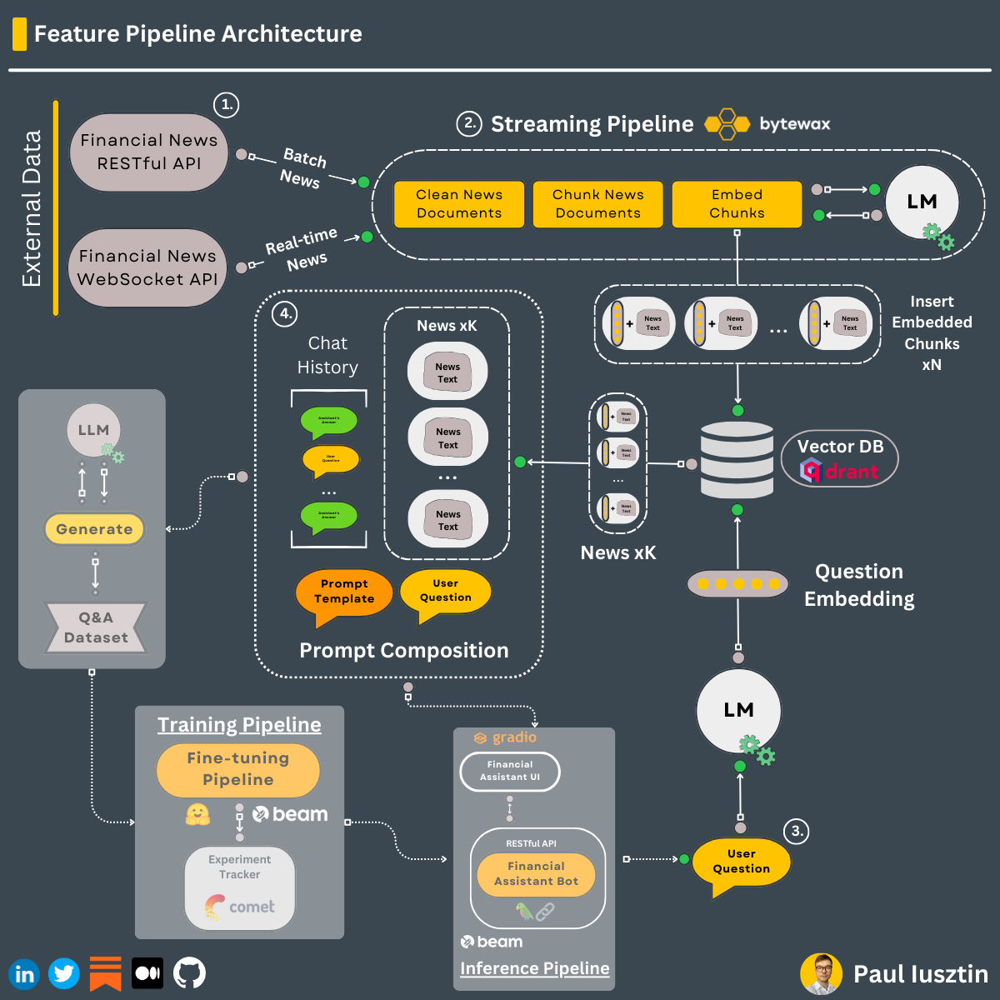
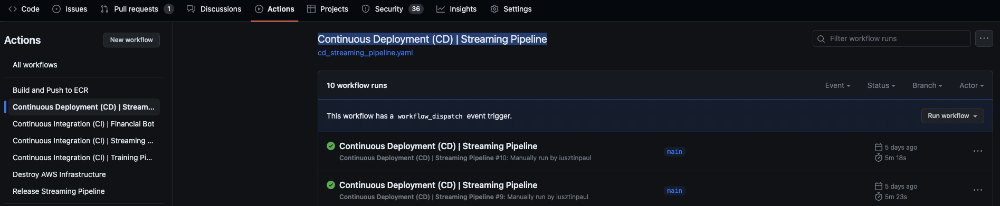

# Streaming Pipeline

Real-time feature pipeline that:
- ingests financial news from [Alpaca](https://alpaca.markets/docs/api-references/market-data-api/news-data/)
- cleans & transforms the news documents into embeddings in real-time using [Bytewax](https://github.com/bytewax/bytewax?utm_source=thepauls&utm_medium=partner&utm_content=github)
- stores the embeddings into the [Qdrant Vector DB](https://qdrant.tech/?utm_source=thepauls&utm_medium=partner&utm_content=github)

The **streaming pipeline** is **automatically deployed** on an AWS EC2 machine using a CI/CD pipeline built in GitHub actions.


## Table of Contents

- [1. Motivation](#1-motivation)
- [2. Install](#2-install)
    - [2.1 Dependencies](#21-dependencies)
    - [2.2. Alpaca & Qdrant](#22-alpaca--qdrant)
    - [2.3. AWS CLI](#23-aws-cli)
- [3. Usage](#3-usage)
    - [3.1. Local](#31-local)
    - [3.2. Docker](#32-docker)
    - [3.3. Deploy to AWS](#33-deploy-to-aws)
    - [3.4. Linting & Formatting](#34-linting--formatting)

---


# 1. Motivation

The best way to ingest real-time knowledge into an LLM without retraining the LLM too often is by using RAG.

To implement RAG at inference time, you need a vector DB always synced with the latest available data.

The role of this streaming pipeline is to listen 24/7 to available financial news from [Alpaca](https://alpaca.markets/docs/api-references/market-data-api/news-data/), process the news in real-time using [Bytewax](https://github.com/bytewax/bytewax?utm_source=thepauls&utm_medium=partner&utm_content=github), and store the news in the [Qdrant Vector DB](https://qdrant.tech/?utm_source=thepauls&utm_medium=partner&utm_content=github) to make the information available for RAG.

<br/>




# 2. Install

## 2.1. Dependencies

Main dependencies you have to install yourself:
* Python 3.10
* Poetry 1.5.1
* GNU Make 4.3
* AWS CLI 2.11.22

Installing all the other dependencies is as easy as running:
```shell
make install
```

When developing run:
```shell
make install_dev
```

Prepare credentials:
```shell
cp .env.example .env
```
--> and complete the `.env` file with your [external services credentials](https://github.com/iusztinpaul/hands-on-llms/tree/main#2-setup-external-services).


## 2.2. Alpaca & Qdrant

Check out the [Setup External Services](https://github.com/iusztinpaul/hands-on-llms/tree/main#2-setup-external-services) section to see how to create API keys for them.


## 2.3. AWS CLI
`deploy the streaming pipeline to AWS [optional]` 

You can deploy the streaming pipeline to AWS in 2 ways:
1. **running Make commands**: install & configure your [AWS CLI 2.11.22](https://docs.aws.amazon.com/cli/latest/userguide/getting-started-install.html) as explained in the [Setup External Services](https://github.com/iusztinpaul/hands-on-llms/tree/main#2-setup-external-services) section
2. **using the GitHub Actions CI/CD pipeline**: only create an account and generate a pair of credentials as explained in the [Setup External Services](https://github.com/iusztinpaul/hands-on-llms/tree/main#2-setup-external-services) section


# 3. Usage

## 3.1. Local

Run the streaming pipeline in `real-time` and `production` modes:
```shell
make run_real_time
```

To populate the vector DB, you can ingest historical data from the latest 8 days by running the streaming pipeline in `batch` and `production` modes:
```shell
make run_batch
```

For debugging & testing, run the streaming pipeline in `real-time` and `development` modes:
```shell
make run_real_time_dev
```

For debugging & testing, run the streaming pipeline in `batch` and `development` modes:
```shell
make run_batch_dev
```

To query the Qdrant vector DB, run the following:
```shell
make search PARAMS='--query_string "Should I invest in Tesla?"'
```
You can replace the `--query_string` with any question.

## 3.2. Docker

First, build the Docker image:
```shell
make build
```

Then, run the streaming pipeline in `real-time` mode inside the Docker image, as follows:
```shell
make run_real_time_docker
```


## 3.3. Deploy to AWS

### 3.3.1. Running Make commands

First, ensure you successfully configured your AWS CLI credentials.

After, run the following to deploy the streaming pipeline to a `t2.small` AWS EC2 machine: 
```shell
make deploy_aws
```

**NOTE:** You can log in to the AWS console, go to the EC2s section, and you can see your machine running.

To check the state of the deployment, run:
```shell
make info_aws
```

To destroy the EC2 machine, run:
```shell
make undeploy_aws
```

### 3.3.2. Using the GitHub Actions CI/CD pipeline

Here, you only have to ensure you generate your AWS credentials.

Afterward, you must fork the repository and add all the credentials within your `.env` file into the forked repository secrets section. 

Go to your `forked repository -> Settings -> Secrets and variables -> Actions -> New repository secret`.

Now, add all the secrets as in the image below. 


Now, to deploy the streaming pipeline to AWS using GitHub Action's CI/CD pipeline, follow the next steps: `Actions Tab -> Continuous Deployment (CD) | Streaming Pipeline action (on the left) -> Press "Run workflow"`.



To automatically destroy all the AWS components created earlier, you have to call another GitHub Actions workflow as follows: `Actions Tab -> Destroy AWS Infrastructure -> Press "Run workflow"`

----

**In both scenarios,** to see if your EC2 initialized correctly, connect to your EC2 machine and run:
```
cat /var/log/cloud-init-output.log
```
Also, to see that the docker image is running:
```
docker ps
```
**Note:** You have to wait for ~5 minutes until everything is initialized fully.

## 3.4. Linting & Formatting

**Check** the code for **linting** issues:
```shell
make lint_check
```

**Fix** the code for **linting** issues (note that some issues can't automatically be fixed, so you might need to solve them manually):
```shell
make lint_fix
```

**Check** the code for **formatting** issues:
```shell
make format_check
```

**Fix** the code for **formatting** issues:
```shell
make format_fix
```
