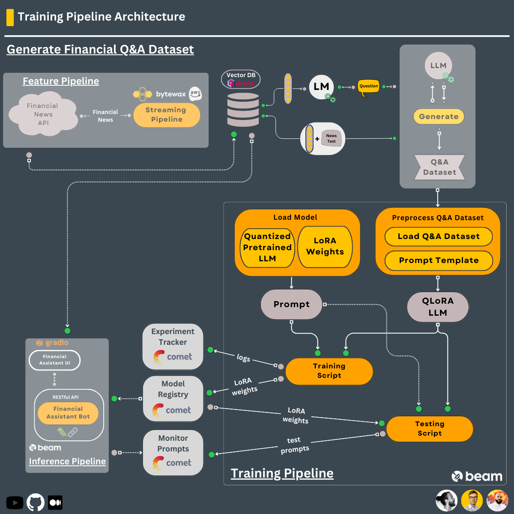

# Training / Fine-tuning Pipeline 

Training pipeline that:
- loads a proprietary Q&A dataset 
- fine-tunes an open-source LLM using QLoRA
- logs the training experiments on [Comet ML's](https://www.comet.com?utm_source=thepauls&utm_medium=partner&utm_content=github) experiment tracker & the inference results on [Comet ML's](https://www.comet.com?utm_source=thepauls&utm_medium=partner&utm_content=github) LLMOps dashboard
- stores the best model on [Comet ML's](https://www.comet.com/site/products/llmops/?utm_source=thepauls&utm_medium=partner&utm_content=github) model registry

The **training pipeline** is **deployed** using [Beam](https://docs.beam.cloud/getting-started/quickstart?utm_source=thepauls&utm_medium=partner&utm_content=github) as a serverless GPU infrastructure.

## Table of Contents

- [1. Motivation](#1-motivation)
- [2. Install](#2-install)
    - [2.1 Dependencies](#21-dependencies)
    - [2.2. Beam](#22-beam)
- [3. Usage](#3-usage)
    - [3.1. Train](#31-train)
    - [3.2. Inference](#32-inference)
    - [3.3. Linting & Formatting](#33-linting--formatting)

-------

# 1. Motivation

The best way to specialize an LLM on your task is to fine-tune it on a small Q&A dataset (~100-1000 samples) coupled to your business use case.

In this case, we will use the finance dataset generated using the `q_and_a_dataset_generator` module to specialize the LLM in responding to investing questions.

<br/>




# 2. Install

## 2.1. Dependencies

Main dependencies you have to install yourself:
* Python 3.10
* Poetry 1.5.1
* GNU Make 4.3

Installing all the other dependencies is as easy as running:
```shell
make install
```

When developing run:
```shell
make install_dev
```

Prepare credentials:
```shell
cp .env.example .env
```
--> and complete the `.env` file with your [external services credentials](https://github.com/iusztinpaul/hands-on-llms/tree/main#2-setup-external-services).


## 2.2. Beam
`deploy the training pipeline to Beam [optional]` 

**First**, you must set up Beam, as explained in the [Setup External Services](https://github.com/iusztinpaul/hands-on-llms/tree/main#2-setup-external-services) section.

In addition to setting up Beam, you have to go to your [Beam account](https://www.beam.cloud?utm_source=thepauls&utm_medium=partner&utm_content=github) and create a volume, as follows:
1. go to the `Volumes` section
2. click create `New Volume` (in the top right corner)
3. choose `Volume Name = qa_dataset` and `Volume Type = Shared`

After, run the following command to upload the Q&A dataset to the Beam volume you created:
```shell
make upload_dataset_to_beam
```
Finally, check out that your [**qa_dataset** Beam volume](https://www.beam.cloud/dashboard/volumes/qa_dataset?utm_source=thepauls&utm_medium=partner&utm_content=github) contains the uploaded data. 

**IMPORTANT NOTE:** The training pipeline will work only on CUDA-enabled Nvidia GPUs. If you don't have one and wish to run the training pipeline, you must deploy it to [Beam](https://www.beam.cloud?utm_source=thepauls&utm_medium=partner&utm_content=github). 

# 3. Usage

## 3.1. Train  
`run the training, log the experiment and model to Comet ML`

### Local

For debugging or to test that everything is working fine, run the following to train the model on a lower number of samples:
```
make dev_train_local
```

For training on the production configuration, run the following:
```shell
make train_local
```

### On Beam

As for training on your local machine, for debugging or testing, run:
```shell
make dev_train_beam
```

For training on the production configuration, run the following:
```shell
make train_beam
```

## 3.2. Inference
`run the inference & log the prompts and answers to Comet ML`

### Local

For testing or debugging the inference on a small subset of the dataset, run:
```shell
make dev_infer_local
```

To run the inference on the whole dataset, run the following:
```shell
make infer_local
```

### Using Beam

As for doing inference on your local machine, for debugging or testing, run:
```shell
make dev_infer_beam
```

To run the inference on the whole dataset, run the following::
```shell
make infer_beam
```

## 3.3. Linting & Formatting

**Check** the code for **linting** issues:
```shell
make lint_check
```

**Fix** the code for **linting** issues (note that some issues can't automatically be fixed, so you might need to solve them manually):
```shell
make lint_fix
```

**Check** the code for **formatting** issues:
```shell
make format_check
```

**Fix** the code for **formatting** issues:
```shell
make format_fix
```
